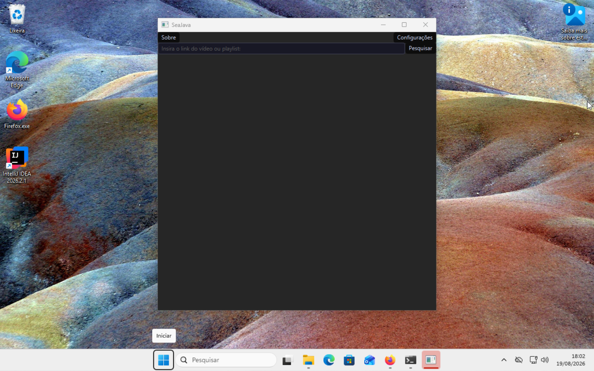
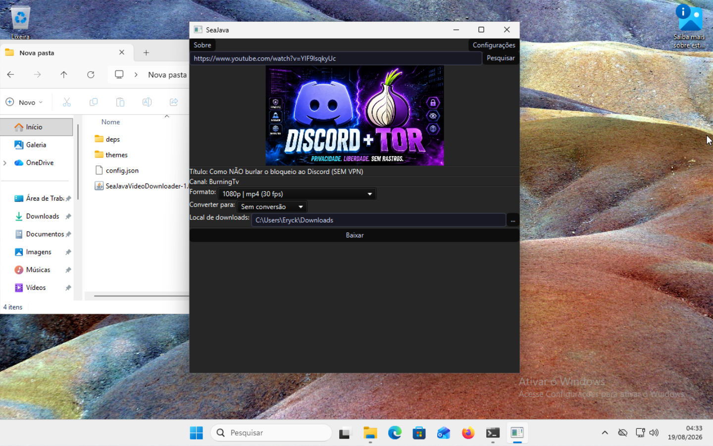
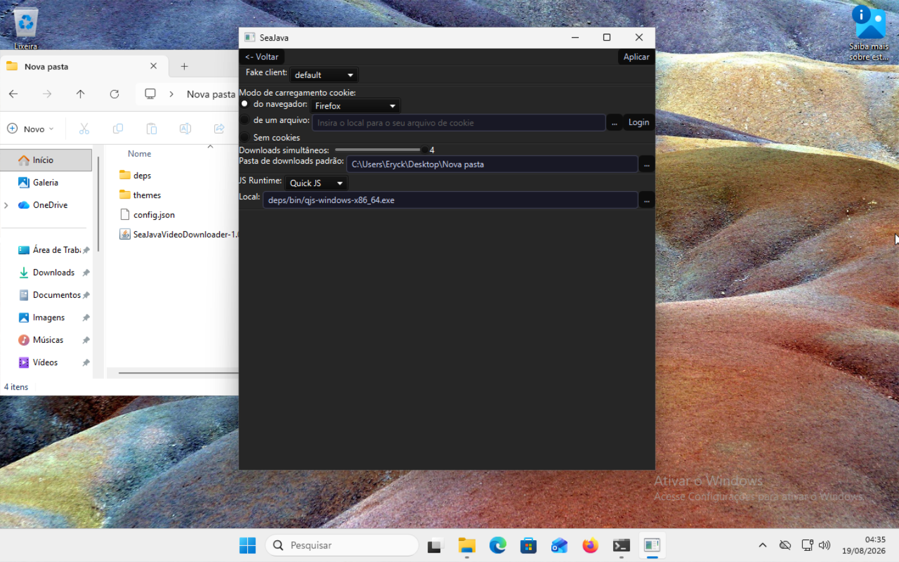
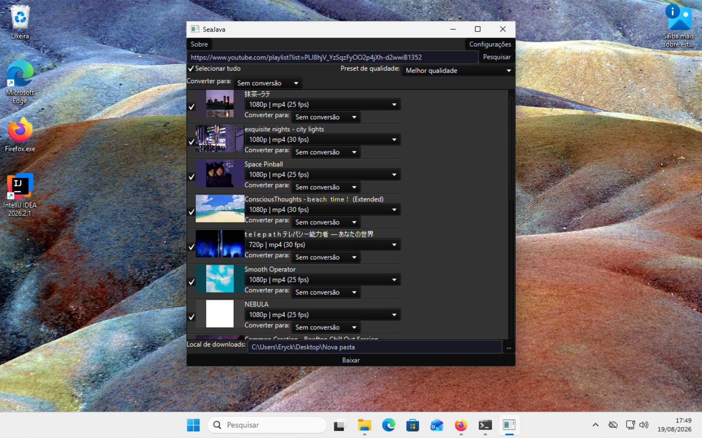

[](README.pt.md)
[](README.md)
[](README.es.md)

# SeaJava Video Downloader

O **SeaJava Video Downloader** é um aplicativo simples e eficiente desenvolvido em JavaFX com o objetivo de possibilitar o download de vídeos e mídias de diversas plataformas.

---

### 🌐 Plataformas Suportadas (Testadas)
-  **YouTube**
-  **Facebook**
-  **Instagram**
-  **TikTok**
-  **Rumble**

---

## 📋 Requisitos do Sistema

- **Sistema Operacional:** Windows ou Linux
- **Conexão:** Acesso à internet
- **Armazenamento:** 635 MB de espaço livre em disco
- **Java:** [Java 21.0 ou superior](https://www.oracle.com/java/technologies/javase/jdk21-archive-downloads.html)

---

## 🖼️ Capturas de Tela

|<p align="center"><b>Tela Inicial</b></p> | <p align="center"><b>Downloads de Mídia</b></p> |
|:---:|:---:|
|  |  |

|<p align="center"><b>Configurações</b></p> | <p align="center"><b>Download de Playlist</b></p> |
|:---:|:---:|
|  |  |


## Como utilizar:
  Em muitos sistemas operacionais, basta dar um **duplo clique** no arquivo `.jar` baixado para abrir o aplicativo.

  Caso o programa não abra automaticamente ou você queira acompanhar os logs de inicialização via terminal, execute:

  ```bash
  java -jar SeaJavaVideoDownloader-x.x.x.jar
  ```            
 ⚠️ A primeira inicialização pode demorar um pouco dependendo da sua internet pois nessa etapa as dependências serão baixadas

 🔑 Nota sobre Cookies: Na maioria das plataformas, cookies de sessão são necessários para baixar conteúdos restritos/privados. No Windows, navegadores baseados no Chromium (como Microsoft Edge, Opera e Google Chrome) podem não funcionar para a extração automática de cookies devido às restrições nativas de segurança do sistema. Recomendamos o uso do Mozilla Firefox.

## Dependências de Código Aberto

Este software é construído sobre excelentes projetos da comunidade open-source:

| Projeto                    | Licença                       | Descrição                                                      | Links                                                                  |
|:---------------------------|:------------------------------|:---------------------------------------------------------------|:-----------------------------------------------------------------------|
| JavaFX                     | GPLv2 com Classpath Exception | Plataforma de interface gráfica para Java.                     | https://openjfx.io/ https://github.com/openjdk/jfx                     |
| Google Gson                | Apache License 2.0            | Serialização e desserialização de objetos Java para JSON.      | https://github.com/google/gson                                         |
| FFmpeg                     | LGPL v2.1+ / GPL v2+          | Framework de manipulação, conversão e muxing de áudio e vídeo. | https://ffmpeg.org/download.html https://github.com/BtbN/FFmpeg-Builds |
| yt-dlp                     | Sem licença (Domínio Público) | Ferramenta de linha de comando para download de mídias da web. | https://github.com/yt-dlp/yt-dlp                                       |
| TwelveMonkeys ImageIO      | BSD 3-Clause License          | Decodificação nativa de imagens WebP em Java puro.             | https://github.com/haraldk/TwelveMonkeys                               |
| XZ para Java (por Tukaani) | Domínio Público               | Biblioteca para manipulação e descompressão de arquivos .xz.   | https://tukaani.org/xz/java.html                                       |
| QuickJS                    | Licença MIT                   | Engine JavaScript leve e incorporável.                         | https://bellard.org/quickjs/ https://github.com/quickjs-ng/quickjs     |
